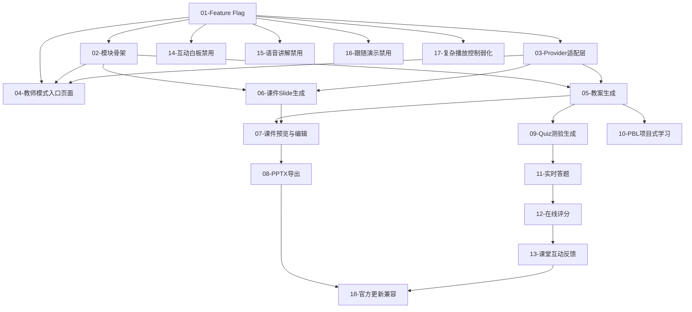

# OpenMAIC 教师扩展模块 — 详细开发计划索引

> 本目录包含 OpenMAIC 二次开发扩展模块的所有功能点开发计划文档。
> 每个文件是一个独立的功能点，包含功能内容、实现路径、依赖关系和验证方案。

---

## 项目概况

- **项目名称**：OpenMAIC 教师扩展模块
- **技术栈**：Next.js (App Router) + TypeScript + pnpm
- **改造原则**：新增扩展模块 + 功能开关控制 + 保留核心互动能力
- **核心约束**：不破坏 OpenMAIC 原有功能体系，不随意改变原有生成逻辑

---

## 阶段规划与功能点索引

### 🏗️ 第零阶段：基础设施搭建

| 序号 | 文件 | 功能点 | 优先级 |
|------|------|--------|--------|
| 01 | [01-Feature-Flag-功能开关系统.md](./01-Feature-Flag-功能开关系统.md) | 统一功能开关配置系统 | P0 |
| 02 | [02-教师扩展模块骨架.md](./02-教师扩展模块骨架.md) | 教师扩展模块目录结构与路由骨架 | P0 |
| 03 | [03-Provider适配层.md](./03-Provider适配层.md) | 服务提供者适配层（对接原有生成能力） | P0 |

---

### 📚 第一阶段：核心备课流程

| 序号 | 文件 | 功能点 | 优先级 |
|------|------|--------|--------|
| 04 | [04-教师模式入口页面.md](./04-教师模式入口页面.md) | 教师模式入口页面（基于原首页裁剪） | P1 |
| 05 | [05-教案生成功能.md](./05-教案生成功能.md) | 教师教案创建与AI生成 | P0 |
| 06 | [06-课件Slide生成功能.md](./06-课件Slide生成功能.md) | 丰富课件内容生成与展示 | P0 |
| 07 | [07-课件预览与编辑.md](./07-课件预览与编辑.md) | 课件预览页面与教师编辑能力 | P0 |
| 08 | [08-PPTX导出功能.md](./08-PPTX导出功能.md) | PPTX 导出能力保留与优化 | P0 |

---

### 🎯 第二阶段：课堂互动能力

| 序号 | 文件 | 功能点 | 优先级 |
|------|------|--------|--------|
| 09 | [09-Quiz测验生成功能.md](./09-Quiz测验生成功能.md) | 测验 Quiz 生成与管理 | P1 |
| 10 | [10-PBL项目式学习功能.md](./10-PBL项目式学习功能.md) | PBL 项目式学习内容生成 | P1 |
| 11 | [11-实时答题功能.md](./11-实时答题功能.md) | 课堂实时答题接入 | P1 |
| 12 | [12-在线评分功能.md](./12-在线评分功能.md) | 在线评分与结果统计 | P1 |
| 13 | [13-课堂互动反馈功能.md](./13-课堂互动反馈功能.md) | 课堂互动反馈展示 | P1 |

---

### 🔇 第三阶段：功能禁用与控制

| 序号 | 文件 | 功能点 | 优先级 |
|------|------|--------|--------|
| 14 | [14-互动白板禁用.md](./14-互动白板禁用.md) | 互动白板功能禁用 | P2 |
| 15 | [15-语音讲解禁用.md](./15-语音讲解禁用.md) | 语音讲解与播放功能禁用 | P2 |
| 16 | [16-跟随演示禁用.md](./16-跟随演示禁用.md) | 跟随演示功能禁用 | P2 |
| 17 | [17-复杂播放控制弱化.md](./17-复杂播放控制弱化.md) | 复杂实时播放控制弱化 | P2 |

---

### 🔄 第四阶段：兼容与优化

| 序号 | 文件 | 功能点 | 优先级 |
|------|------|--------|--------|
| 18 | [18-官方更新兼容策略.md](./18-官方更新兼容策略.md) | 官方版本兼容与同步策略 | P2 |

---

## 依赖关系图

---

## 使用说明

1. **按顺序实施**：从第零阶段开始，每个阶段内的功能点可并行开发
2. **每个文件独立**：每个 `.md` 文件描述一个独立功能点，包含完整的实现指南
3. **状态追踪**：每个文件头部标注当前状态（待开发 / 开发中 / 已完成 / 已验证）
4. **依赖检查**：开始某功能点前，先检查其前置依赖是否已完成
